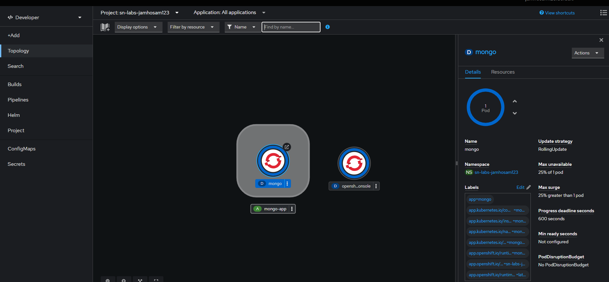

# IBM Back-end Application Development Capstone: Songs Microservice


This repository contains the Flask-based microservice for handling song data in the IBM Back-end Application Development Capstone Project, part of the [IBM Back-End Development Professional Certificate](https://www.coursera.org/professional-certificates/ibm-backend-development) on Coursera. It integrates with MongoDB to manage song lyrics and details via a RESTful API. This microservice works with the Pictures microservice and the main Django application to build an event management system for a fictional music band website.

## Project Overview

As the second microservice, this component manages song resources in a NoSQL database. Key features include:
- CRUD operations on song resources using PyMongo.
- Health and count endpoints for monitoring.
- Database interactions for scalable data handling.

This is **Part 2** of the capstone project. For the full architecture:
- [Back-End-Development-Pictures](https://github.com/HossamJa/Back-End-Development-Pictures): Part 1 - Pictures Microservice.
- [Back-end-Development-Capstone](https://github.com/HossamJa/Back-end-Development-Capstone): Part 3 - Main Django Application and integration.

The overall project enables users to view song lyrics, pictures from events, upcoming concerts, and manage user registrations.

## Accomplishments in This Module

Completed in Module 2: Creating Get Songs Service with Flask.
- Initialized development environment and started MongoDB server.
- Implemented endpoints: `/health`, `/count`, `/song` (GET/POST/PUT/DELETE), `/song/<id>` (GET/PUT/DELETE).
- Tested APIs using curl commands.
- Evidence screenshots:

  **Health Endpoint Curl**
  - 
  - 
  **GET Song Curl**
  - 
 
  **PUT Song Curl**
  - 

  **DELETE Song Cur**
  - 

  - ### Deployment screenshots from Module 4:
 
    **MongoDB Deploymen**
    
 
    **Topology View**
    
 
    **OC New-App Output**
    
 
    **OC Expose Output**
    
 
    **Health Endpoint in Browser**
    

## Technologies Used

- **Framework**: Flask for REST API.
- **Database**: MongoDB (NoSQL) with PyMongo.
- **Deployment**: Docker, RedHat OpenShift.

## Installation and Setup

1. Clone the repository:
   ```
   git clone https://github.com/HossamJa/Back-End-Development-Songs.git
   ```
2. Navigate to the directory:
   ```
   cd Back-End-Development-Songs
   ```
3. Set up the environment:
   ```
   bash ./bin/setup.sh
   ```
4. Install dependencies:
   ```
   pip install -r requirements.txt
   ```
5. Start MongoDB (local or cloud) and update connection in code.
6. Run the application:
   ```
   flask run
   ```
7. Test endpoints (e.g., via curl):
   ```
   curl http://localhost:5000/health
   ```

## Deployment

- Containerize with Docker.
- Deploy to RedHat OpenShift, alongside MongoDB instance.
- Integrate with the main Django app for full functionality.

## License

Licensed under the Apache License 2.0 - see the [LICENSE](LICENSE) file for details.

## Acknowledgments

- IBM and Coursera for the Back-End Development Professional Certificate.
